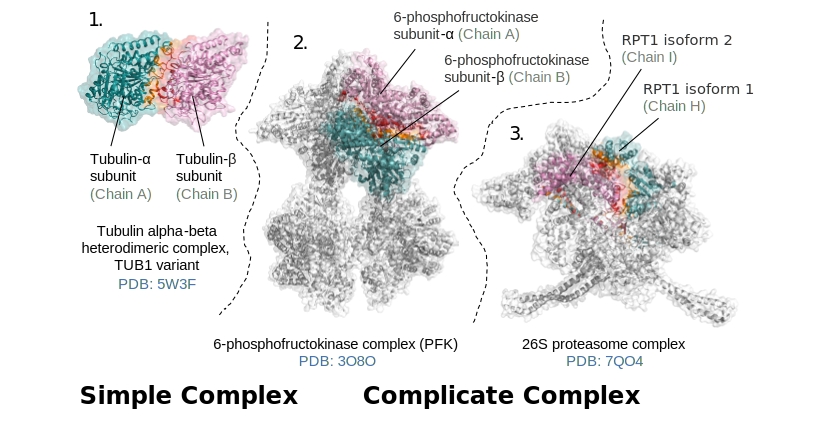
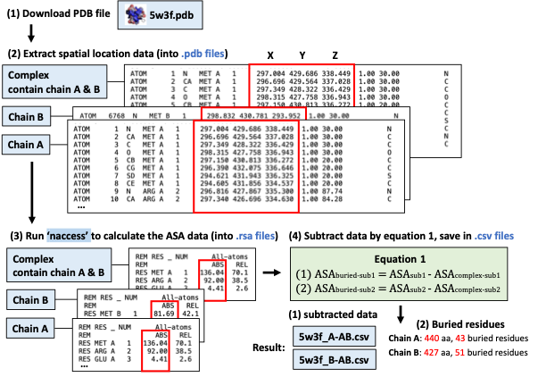
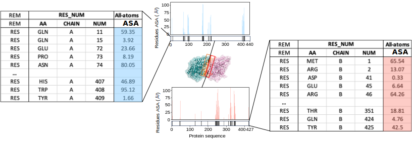
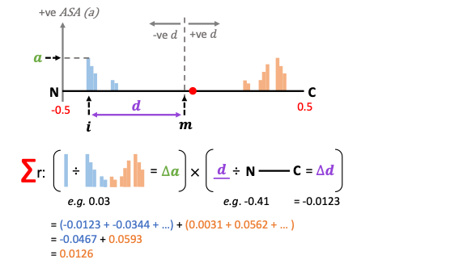
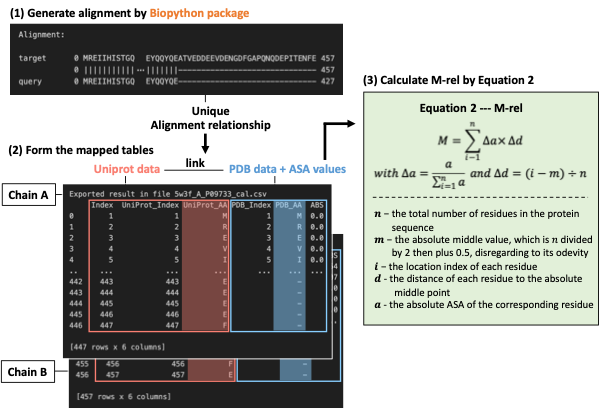
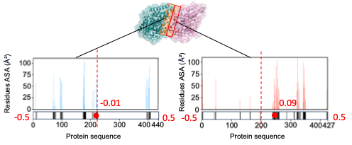
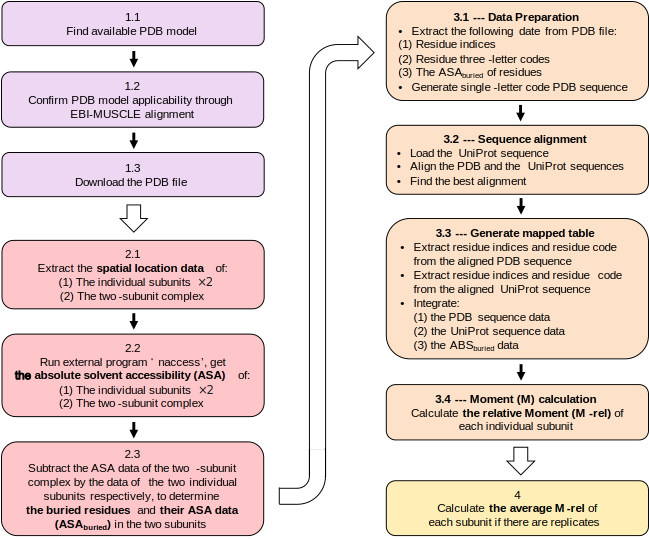
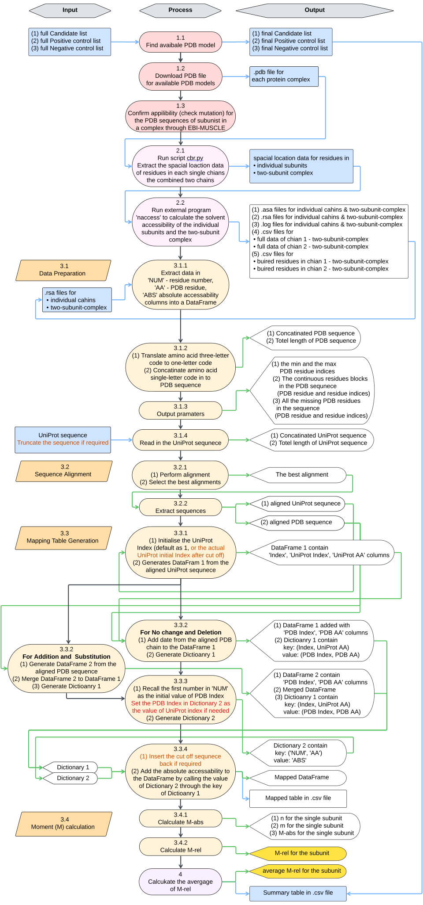

# Identify buried residues in protein subunits and calculate its relative moment 

## Background knowledge

There are many protein complexes in nature with various structures and functions. They can be classified into two categories: 
- Homomeric complex: consists of multiple copies of the same protein chains
- Heteromeric complex: consists of multiple copies of different protein chains

Understanding the protein complex assembly mechanism is fundamental, especially for the complicated protein complex machines that play important role in various biological process. Any assembly must start from two protein subunits, so here a two-subunit complex is the study object for the tools to run on.

To visulise protein complexes, the figure below shows three example that represent all conditions of heteromeric protein complex (from *Saccharomyces cerevisiae*):

1. **5W3F** --- Simple heteromeric complex: only contain two subunits
2. **3O8O** --- Complex heteromeric complex: contain multiple copy (4 at here) of the same two-subunit complex
3. **7QO4** --- Complex heteromeric complex: contain multiple copy of different subunits

A single two-subunit complex are highlighed in each model, with one subunit coloured in teal and another one coloured in pink. The buried residues in each subunit that contributed to form the protein-protein interface is highlighted in orange and red respectively. The background subunits are in white.




## Description
This repository contain two Python scripts that provide tools to work on protein complex that contains at least two subunits.

1. **Tool CBR: cbr.py / cbr.ipynb** (cbr stands for Calculate Buried Residues)  
   It runs an external program "naccess" to calculate the Solvent Surface Accessability (ASA) of each residues in the amino acid sequence (chains) of the two subunits in a two-subunit complex, then identify the buried residues within each subunit, if there is any.  
   (This calculation is recommend to run the cbr.py script in commend line. The cbr.ipynb is only to shows steps)
   
1. **Tool CRM: crm.ipynb** (crm stands for Calculate Relative Moments)  
   It uses the output results from the first step to calculate a value called Relative Moment (M-rel) for each subunit in the a two-subunit complex.  
   (You need one cal.ipynb file for each subunit in one combination of two-subunit complex)


### 1. Tool CBR: cbr.py / cbr.ipynb

**Principle:**

This tool identify the buried residues in each subunit within a two-subunit complex, if there is any. The rational is illustrated by this schematic diagram.

For a two-subunit complex contain subunit 1 (blue) and subunit 2 (red), the (protein-protein) interface (yellow) comes from the overlap of the (buried) surface 1 (light blue) and the (buried) surface 2 (pink) from the corresponding subunits. 

The program "naccess" written by Simon Hubbard (1992) calculates the Absolute Solvent Accessability (ASA) (water, by default) of each residues in one or multiple chains environment (naccess produce more data but we only care about ASA here). 

This tool utilises the "naccess", for each two-subunit complex, calculate the ASA for each residues in the two 'single chain only' status and the one 'within a complex' status. If a residues contribute to the formation of the buried residues, they will be less accessible in the 'within a complex' status and therefore have smaller values. The residues do not contribute to the formation will be equivalently accessibly in both statuses and therefore have the same values. 

By subtracting the ASA values in 'within a complex' status using the two 'single chain only' status for each residues in the two chains, the buried residues will have a negative value, and therefore being determined.


**Calculation process:**




**Example result:**

 Using PDB model 5W3F as an example:

 - The output result will look like the data in the two tables. 
 - The bar plots highlight the location of the buried residues on the scale of the respective subunit protein sequence. 
 - The histograms show the size of the ASA values of these buried residues.





### 2. Tool CRM: crm.ipynb

**Principle:**

To determine the relative location of the buried surface of a subunit, a concept of Relative Moment (M-rel) of a subunit was raised as the overall contribution of two values:  
- (1) `the relative absolute ASA (∆a)`  --- reflects the contribution from each residue to the total ASA of the whole subunit  
- (2) `the relative distance (∆d)` --- applies a position weight to each residue when considering their contribution/effect to the total ASA of the whole subunit. 

The **N-terminal sequence** and the **C-terminal sequence** are defined as the two halves of a protein sequence that towards the different two ends when separated from the middle point. The effect of residues on the N-terminal of the sequence counteracts the effect of residues on the C-terminal. 

Since `∆d` is in the range from `-0.5 to 0.5` and `∆a` is in the range from `0 to 1`. The value of M-rel would be in the range of `-1 to 1`, which enables comparison between subunits from different complexes. The direction of the relative Moment (M-rel) (smaller or greater than 0) indicates whether the buried surface of a particular subunit is located on the N terminal or the C terminal. The more extreme the number, the more the buried surface localises towards the two ends in the protein sequence of a subunit. 




**Calculation process:**





**Example result:**

 Using PDB model 5W3F as an example:
 - The two extremes of each protein subunit have the M-rel values of -0.5 and 0.5. The location of M-rel = 0.0 is drown by dash lines in the middle. The calculated M-rel values (-0.01 and 0.09) of the two subunits are visualised as the red dots in the bar plots.




## Requirements
- Python 3
- Naccess (download by link in references)
- Pandas library
- Biopython package

## Workflow
The figure shows the workflow of the two scripts.  
### CBR  
>**Section 1:** Download PDB files  
>**Section 2:** Calculate ASA values  
### CRM  
>**Section 3:** Mapping data  
>**Section 4:** Calculate (average) M-rel



In details, this flowchart shows the function of each step and the relevant input and output files.



---

## Usage Instructions

## 1. Tool CBR: cbr.py / cbr.ipynb

### Arguments:
**Positional arguments:**  
- `path`                  path to a PDB file or a folder containing PDB files

**Options:**  
- `-h, --help`            show this help message and exit  
- `-a, --all`             process all chains in each model  
- `-p PART [PART ...], --part PART [PART ...]` process a part of chains in each model, require at least two chain IDs, e.g. -p A B C  
- `-d, --designated`      process two designated chains in each model
- `-e, --example`         show example usage

### This tool has 3 modes:
1. **Mode [-a --all]:** Process all chains in each model
   
   Input example: `python ./cbr.py 2uv8.pdb -a`

2. **Mode [-p --part]:** Process a part of chains in each model  
   This mode run similar to the -a --all mode, but only process data for partial chains.  
   It requires to specify the chains IDs after -p flag (case sensitive).
   
   e.g. PDB model 6oa9 has 10 chains ['A','B','C','D','E','F','G','H','I','J']  
   Input example: `python ./cbr.py 2uv8.pdb -p A B E F`  
   
   This mode will only perform calculation on the unique two-chian-complex combinations between these four chains.

3. **Mode [-d --designated]:** Process two designated chains in each model  
   This mode only run on designated two chains of each PDB model.

   e.g. PDB model 6oa9 has 10 chains ['A','B','C','D','E','F','G','H','I','J']  
   Input example: `python ./cbr.py 2uv8.pdb -d`
    
    The IDs of chains in this .pdb file will be print to screen, then an input request will popup.  
    Enter e.g. A B (case sensitive) in input popup, the program will only perform calculation on the unique combination of these 2 chains.

### This tool perform calculations in two stages:
1. **Stage 1:**  
    Generates .pdb files for each individual chain and all possible unique two-chain-complex combinations.  
    e.g. for PDB model 4ffb has 3 chains ['A','B','C'], generate:  
    >"4ffb_A.pdb", "4ffb_B.pdb", "4ffb_C.pdb",  
    >"4ffb_AB.pdb", "4ffb_AC.pdb", "4ffb_BC.pdb"
        
2. **Stage 2:** --- will only perform if select "y" in the popup: "Type "y" to run or "n" to quit:"

   (1) Calculate the absolute and relative accessibility of residues by the .pdb files, get:  
   >"4ffb_A.rsa", "4ffb_B.rsa", "4ffb_C.rsa",  
   >"4ffb_AB.rsa", "4ffb_AC.rsa", "4ffb_BC.rsa"
       
   (2) Calculate the subtracted data of each unique two-chain-complex by the data of 
       its consisted two individual chains, get e.g.:  
   >"4ffb_A-AB.csv", "4ffb_B-AB.csv",  
   >"4ffb_A-AC.csv", "4ffb_C-AC.csv",  
   >"4ffb_B-BC.csv", "4ffb_C-BC.csv"
            
   (3) If there is any, write the data of buried residues, get e.g.:  
   >"4ffb_A-AB_buried_residues.csv", "4ffb_B-AB_buried_residues.csv",  
   >"4ffb_A-AC_buried_residues.csv", "4ffb_C-AC_buried_residues.csv",  
   >"4ffb_B-BC_buried_residues.csv", "4ffb_C-BC_buried_residues.csv"

### Note: 
1. The PDB model name can not contain ".", "-", or "_", otherwise would cause error.
   The conventional 4 letter + number name is recommended, e.g. 5w3f
2. You have to make sure the "naccess" program export .rsa files to the right directory that this 
   script can read in, otherwise would cause error. By default, this script read in .rsa files from 
   the same directory it is located in. You can change the output pathway in the "naccess" scrip.

### Examples:  
The .pdb file and the resulted output files calculated by tool CBR for protein complex insulin (PDB: 2ptc) is given as an example.

## 2. Tool CRM: crm.ipynb

### Required input: --- for each subunit   
(1) The .csv file contain the subtracted ASA values of each residues in the PDB amino acid sequence  
(2) A .txt file contain the UniPort sequence  
--- This file can be named as **uniport_seq.txt** by default  
--- if working on different chains, it can be refilled with different UniPort sequences

### Part 1: prepare data 
**1.1** Input (extract) the data of "PDB index", "amino acid code", and "ASA value" of each residue in chain from the .csv file
   > e.g. Extract data from file 5w3f_A-AB.csv for PDB model 5w3f, chain A, in two-subunit complex AB  
**Example input:** `filepath = '/Users/luna/Documents/RP1/2_do_cal_and_result/5w3f_A-AB.csv'`


**1.2 & 1.3** Define function and translate the three_letter-code in to one-letter-code. Write the one-letter-code back back to the pandas.DataFrame. 
```
Example output:

(2, 'R') 0.0
(3, 'E') 0.0
...
(10, 'G') 0.0
(11, 'Q') 33.2
```
Finally, generate the PDB sequence with contain single-letter-code, report the sequence length to screen.

**1.4** Determine the minimum and the maximum index of residues in the PDB sequence. Report the start and the end of continue sequence blocks to screen. Report any missing blocks in the middle.
- This stop provides information for getting the correct alignment in the next step. The PDB sequence might start or might not start from index 1, and finish at varies numbers. If not starting from 1, this means the PDB sequence has data missing at the beginning of the UniProt sequence.
   
- If only one block is detected, this means the sequenced PDB sequence is complete, there is no data missing in the middle of the block. If there are more than block detected, this means "deletion" mutation exist in the middle. Manually adjustment will be required in later steps.
  
```
Example output 1: --- "perfect alignment"

For the corresponding sequence in PDB model 5w3f, the PDB aa range: 
min: 1, max: 440

Identified PDB aa block:
1(M)-440(S)

Missing PDB aa:
None
```
```
Example output 2: --- have data missing ("deletion") at the beginning of the sequence

For the corresponding sequence in PDB model 1id3, the PDB aa range: 
min: 38, max: 134

Identified PDB aa block:
38(P)-134(R)

Missing PDB aa:
None
```
```
Example output 3: --- have data ("deletion") missing in the middle of the sequence

For the corresponding sequence in PDB model 2uv8, the PDB aa range: 
min: 1, max: 1747

Identified PDB aa block:
1(M)-94(P)
140(I)-179(K)
181(T)-302(L)
328(L)-540(Q)
599(M)-875(T)
881(N)-1747(A)

Missing PDB aa:
95-139
180
303-327
541-598
876-880
```

**1.5** 
Extract the UniPort sequence from file. For convinence, this step can be performed by setting up a local **uniprot_seq.txt**, then manually copy and paste only the UniPort sequence data in FASTA form (including the title line start with ">") for different subunits.  
**Example input:** `uniprot_filepath = '/Users/luna/Documents/RP1/2_do_cal_and_result/uniprot_seq.txt'`

```
Example output:

The Uniprot sequence of P09733 is loaded, length: 447
MREVISINVGQAGCQIGNACWELYSLEHGIKPD ... EVGADSYAEEEEF
```

### Part 2 Perform Alignment
**2.1** Align the respect PDB sequence (query) to the UniPort sequence (target),
```
Example output: 
    
target            0 MREVISINVGQAGCQIGNACWELYSLEHGIKPDGHLEDGLSKPKGGEEGFSTFFHETGYG
                  0 -|||||||||||||||||||||||||||||||||||||||||||||||||||||||||||
query             0 -REVISINVGQAGCQIGNACWELYSLEHGIKPDGHLEDGLSKPKGGEEGFSTFFHETGYG
                     ...
target          420 EAREDLAALERDYIEVGADSYAEEEEF 447
                420 ||||||||||||||||||||------- 447
query           419 EAREDLAALERDYIEVGADS------- 439
```

**2.2** Extract the PDB and the UniProt sequence in the alignment relationship.
```
Example output: 

aligned_uniprot
MREVISINVGQAGCQIGNACWELYSLEHGIKPD ... EVGADSYAEEEEF
aligned_pdb
MREVISINVGQAGCQIGNACWELYSLEHGIKPD ... EVGADS-------
```

### Part 3 Generate dataframes and dictionaries
**3.1** 
Generating a Dataframe contain information of "Index", "UniProt_Index", "UniProt_AA" from the after-alignment PDB sequence. Any substitution found during alignment will result in an "-" in the "UniProt_AA" column.

**3.2** 
Depends on weather:
1. Substitution or Addition
2. Deletion  

are happened, two set of codes are written to deal with different situations.

A **dictionary_1** contain `key:value = (pdb_index, pdb_aa):rel_value` is generated using the DataFrame generated from **1.3** to add the information into the Dataframe created in **3.1**.
```
Example output: 

(1, 'M') (1, 'M')
(2, 'R') (2, 'R')
(3, 'E') (3, 'E')
...
(446, 'E') (446, '-')
(447, 'F') (447, '-')
```

**3.3** Create **dictionary_2** from the PDB sequence to UniPort alignment relationship, has `key:value = (real_index, uniport_aa):(aa_index, pdb_aa)`

Then, use the `(real_index, uniport_aa)` from the aligned_target (the key of dictionary_2), 
which is the `uniport_key`, to extract the value from dictionary_2, which is the `pdb_key`,
then use the pdb_key to extract the value from dictionary_1, to get the corresponding ASA value.

**3.4** Use the called information to update the DataFrame, save the PDB and UniPort data mapped information into a .csv file.

``` 
Example output:

Exported result in file 5w3f_A_P09733_cal.csv 
     Index  UniProt_Index UniProt_AA PDB_Index PDB_AA  ABS
0        1              1          M         1      M  0.0
1        2              2          R         2      R  0.0
2        3              3          E         3      E  0.0
3        4              4          V         4      V  0.0
4        5              5          I         5      I  0.0
..     ...            ...        ...       ...    ...  ...
442    443            443          E                -     
443    444            444          E                -     
444    445            445          E                -     
445    446            446          E                -     
446    447            447          F                -     

[447 rows x 6 columns]
```

### Part 4 Calculate the moment(M)
**4.1** Calculate the Absolute Moment (M-abs) --- by equation: `M = sum of [r * (i - m)]`  
(this step doesn't have the meaning by itself, just to check the calculation process)  

**4.2** Calculate the Relative Moment (M-rel) --- by equation: `show in the principle figure above`

where:
- `n` --- the total length of UniProt sequence (n = max(UniProt_Index))
- `m` --- the middle value that can separate the UniProt sequence into equivalent upper and lower two sections. (This is to make sure the REl value for aa counting form both ends has the same weight, so they can counter each other)
- `i` --- the UniProt_Index of each PDB aa
- `r` --- the ASA value of each PDB aa, when the data in the ABS column is not 0.0 and there is a corresponding UniProt aa for the PDB aa. (This is to make sure the calculation is based on the UniProt sequence, so any addition from the PDB sequence would not affect the calculation)


### Note:

This work only able to give a .ipynb notebook to run manually instead of a commend line script due to the complexity for this calculation.  

**--- The bottle neck steps are:**

(1) Compare to the **UniPort sequence**, small or large sections of sequencing data can be missing in the **PDB sequence** at the beginning or in the middle of the UniPort sequence (due to the limitation of PDB structure detection). 
  
  This cause the index `best_alignment` (`= alignments[0]`, by default) has to be manually selected to get the correct alignment (based on information from code Part 1). If many sections of the sequence data is missing in the PDB sequence, the number of possible alignments can be as large as in the range of 10000 to 100000; The index will be impossible to identify manually. To reduce the possibility, the UniPort sequence in  the .txt file this is missing at the beginning can be manually removed from the sample.txt file before alignment and added back when exporting tables in step 3.4 (Notice, if do so, the UniPort index in 3.1 also need to be changed, see the flowchart above and the ***Example 4*** below). 

(2) From practical experience, the PDB sequence and the UniProt sequence are the same in most of the time, however, three "mutations" can happen in the alignment of the **PDB sequence** to the **UniPort sequence**:  
  - Substitution  
  - Addition 
  - Deletion  

If any of the three "mutation" happen during alignment, the method (in step 3.2) for calculation has to be manually decided to ensure correct output. If performing "for addition and substitution", the index in step 3.3 also need to be changed correspondingly (see the flowchart above and the ***Example 2*** below).
However, from testing, this code is not yet perfect and doesn't 100% solve all situation, as the substituted codes can not be output correctly in table if there is a more than one mutation at the same time (e.g. combined substitution and deletion) and the index of these substituted codes need a manual check. But this code at least give an solution to enable calculation for most of the cases. Suggestions for improvement are welcome!

### Examples:
The cam.ipynb file in repository is given as a template to show the framework. In addition, four pairs of files are also given to show example usage that : 
- Perfect alignment --- best alignment = alignments[0]
- Non perfect alignment --- best alignment ≠ alignments[0]

> **Example 1:** "no mutation" and "perfect alignment"  
<crm_5w3f_A_P09733> and <crm_5w3f_B_P02557>

> **Example 2:** "has mutation" (substitution or addition) and "non perfect alignment, but no manual sequence removal + add back" 
<crm_1id3_A_P61830.ipynb> 

> **Example 3:** "has mutation" (deletion) and "non perfect alignment, but no manual sequence removal + add back" 
<crm_8dar_A-AB_P25694.ipynb> and <crm_8dar_B-AB_P25694.ipynb>

> **Example 4:** "has mutation" (deletion)" and "non perfect alignment, that has manual sequence removal + add back" 
<crm_3o8o_A_P16861.ipynb> and <crm_3o8o_B_P16862.ipynb>
  
---

## Reference
Naccess --- Solvent accessible area calculations (S. Hubbard and J. Thornton, 1992)
http://www.bioinf.manchester.ac.uk/naccess/nac_readme.html  
http://www.bioinf.manchester.ac.uk/naccess/nacdownload.html
